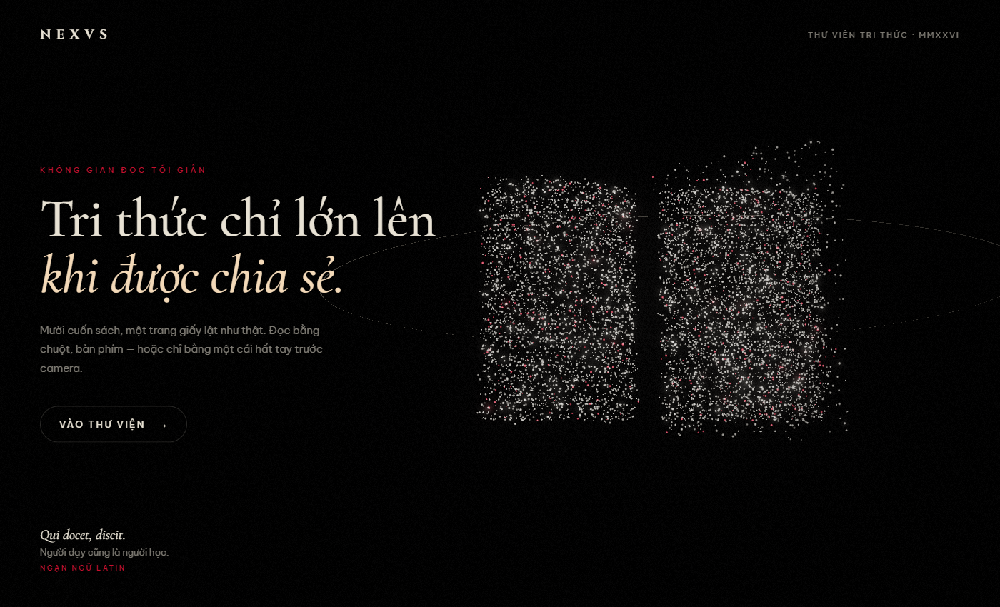
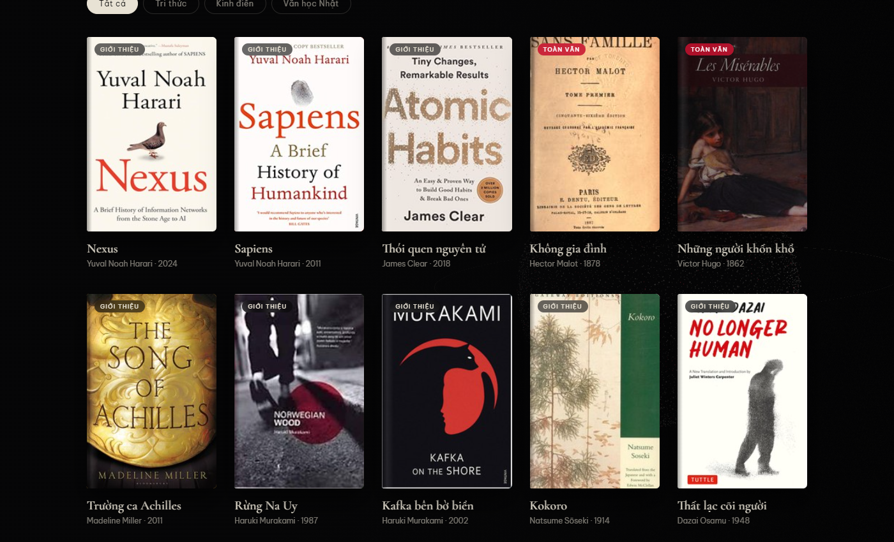
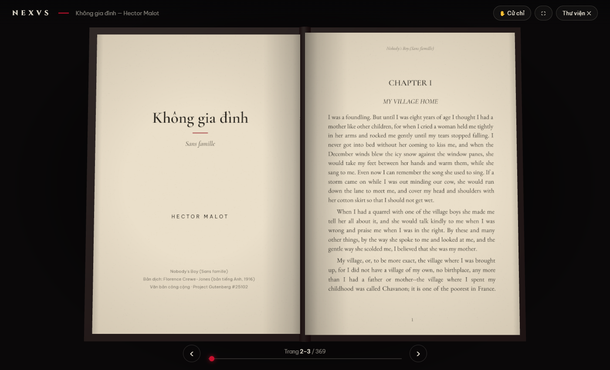

# NEXVS — Thư viện tri thức

Một không gian đọc sách tối giản dựng bằng Three.js: màn hình chính với đám hạt sáng chuyển hình (quả cầu → cuốn sách mở → thiên hà), kệ 10 cuốn sách, và trình đọc 3D toàn màn hình lật trang như thật — bằng chuột, bàn phím hoặc cử chỉ tay trước camera.

| Trang chủ | Thư viện | Trình đọc |
|---|---|---|
|  |  |  |

## Chạy

```bash
npm install      # tự chạy setup: copy MediaPipe wasm, tải model nhận diện tay, tải sách từ Gutenberg và cào Wikisource
npm run dev      # http://localhost:5173
npm run build    # xuất ra dist/
```

Nếu cài khi không có mạng, chạy lại `npm run setup` sau. Ảnh bìa được tải trực tiếp từ Open Library lúc chạy (cần mạng; không có mạng thì hiện bìa chữ).

Mở nhanh: `?view=library` (kệ sách), `?book=<id>` (mở thẳng một cuốn, ví dụ `?book=sans-famille`).

## Kệ sách

| Sách | Nội dung |
|---|---|
| Nexus · Sapiens · Thói quen nguyên tử · Trường ca Achilles · Rừng Na Uy · Kafka bên bờ biển · Kokoro · Thất lạc cõi người | Còn bản quyền (hoặc chưa có bản dịch công cộng): bìa, thông tin và giới thiệu tiếng Việt. Bấm **Gắn PDF** để đọc bản bạn sở hữu — file chỉ lưu trong trình duyệt (IndexedDB) và tự mở ở lần sau. |
| Không gia đình · Những người khốn khổ | Toàn văn, hai bản (nút **Bản: … ⇄** để đổi, app nhớ lựa chọn):<br>• **Tiếng Việt** — phỏng tác của Hồ Biểu Chánh (*Cay đắng mùi đời*, 1923; *Ngọn cỏ gió đùa*, 1926), cào từ Wikisource tiếng Việt. Ông mất năm 1958 nên tác phẩm đã thuộc phạm vi công cộng.<br>• **English** — bản dịch công cộng trên Project Gutenberg (#25102, #135). |

Thêm sách: sửa `src/library/catalog.js` (ID ảnh bìa lấy từ Open Library; sách công cộng thêm `editions` và một dòng tải/cào trong `scripts/setup-assets.mjs`). Bộ cào Wikisource nằm ở `scripts/fetch-wikisource.mjs` — chỉ dùng cho tác phẩm đã hết bản quyền. Ngoài ra có thể kéo thả **PDF bất kỳ** vào trang để đọc.

## Sách của bạn — lưu ở đâu?

Không có server: mọi PDF đều nằm trên máy người dùng.

- **Thư mục trên máy (khuyên dùng, Chrome/Edge):** trong Thư viện bấm **Chọn thư mục trên máy**. PDF được ghi thành file thật trong thư mục đó (sách gắn cho kệ có tên `nexvs-<id>.pdf`, sách riêng giữ tên gốc). Xoá dữ liệu trình duyệt cũng không mất; bỏ PDF vào thư mục bằng File Explorer thì sách tự hiện ở tab **Sách của bạn**. Mỗi lần mở lại trình duyệt chỉ cần bấm **Kết nối lại** một lần (yêu cầu bảo mật của trình duyệt).
- **Trong trình duyệt (dự phòng):** IndexedDB, có xin quyền *lưu trữ bền vững* để trình duyệt không tự dọn. Vẫn mất nếu người dùng tự xoá dữ liệu trang. Khi chọn thư mục, sách đang lưu ở đây sẽ được chuyển sang thư mục.

Code: `src/reader/storage.js`.

## Trình đọc

- **Cử chỉ tay** (nút ✋ Cử chỉ hoặc phím `G`) — chạy hoàn toàn trong trình duyệt với MediaPipe, hình camera không rời khỏi máy:
  - **✋ Hất tay** sang trái → trang sau · sang phải → trang trước (chỉ cần hất nhẹ cổ tay)
  - **🤏 Chụm** ngón cái + ngón trỏ rồi kéo → lật trang chậm theo tay
  - **✊ Nắm tay** → tạm dừng, để di chuyển tay mà không lật nhầm
- **Chuột**: bấm vào trang trái/phải, hoặc kéo mép trang · **Cuộn chuột** lật trang
- **Bàn phím**: `←` `→` `Space` `PageUp/PageDown` `Home` `End`, `F` toàn màn hình

Độ nhạy cử chỉ chỉnh ở đầu `src/reader/gestures.js`.

**Điện thoại / máy tính bảng:** màn hình dọc hoặc hẹp (< 640px) tự chuyển sang chế độ **một trang** — vuốt ngang để lật, chạm nửa phải/trái màn hình để sang trang sau/trước; xoay ngang để xem trang đôi. Thanh công cụ thu gọn thành biểu tượng, texture trang nhỏ hơn để tiết kiệm bộ nhớ GPU.

**Chia sẻ để test nhanh:** `npm run build && npx vite preview --port 4173` rồi `cloudflared tunnel --url http://localhost:4173` (đã cho phép tên miền `*.trycloudflare.com` trong `vite.config.js`).

## Cấu trúc

```
src/
  main.js              điều phối 3 màn: trang chủ ⇄ thư viện ⇄ trình đọc
  intro.js             cảnh hạt sáng chuyển hình + film grain
  quotes.js            trích dẫn Latin – tiếng Việt
  library/
    catalog.js         danh sách sách, giới thiệu, ID bìa
    library.js         giao diện kệ sách + tải nguồn sách
  reader/
    reader.js          cảnh đọc, camera, input, thanh công cụ
    readerBook.js      cuốn sách 3D + vật lý lật trang
    pageCache.js       texture trang theo yêu cầu (LRU)
    pageArt.js         hàm vẽ trang dùng chung
    textSource.js      dàn trang văn bản Gutenberg (căn đều, chương)
    infoSource.js      sách dạng giới thiệu
    pdfSource.js       PDF qua pdf.js
    storage.js         lưu PDF đã gắn (IndexedDB)
    gestures.js        MediaPipe → hất tay / chụm / tạm dừng
scripts/setup-assets.mjs
```
